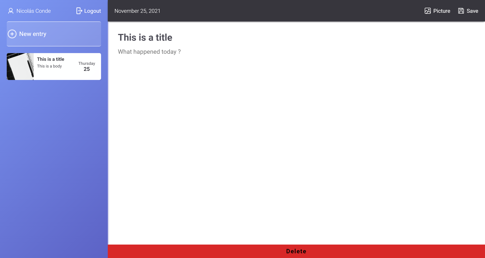

# Journal App

This app was built in React, using Firebase and Firestore for the authentication, Register and Login implementation, journal CRUD, and using Redux for the logic.

## Table of contents

- [Overview](#overview)
  - [The project](#the-project)
  - [Screenshot](#screenshot)
  - [Links](#links)
- [My process](#my-process)
  - [Built with](#built-with)
  - [What I learned](#what-i-learned)
  - [Useful resources](#useful-resources)
- [Author](#author)

## Overview

### The project

Users should be able to:

- Register in the app
- Login with email and password
- See entries
- Create a new entry
- Edit entry
- Delete entry
- Upload image

### Screenshot

### Links

- Solution URL: [Solution URL here](https://github.com/ncondes/react-journal-app)
- Live Site URL: [Live site URL here](https://ecstatic-nightingale-d4d770.netlify.app//)

## My process

### Built with

- Semantic HTML5 markup
- CSS custom properties
- Flexbox
- CSS Grid
- Mobile-first workflow
- Sass
- Redux
- Jest
- Enzyme
- [React](https://reactjs.org/) - JS library
- [Firebase](https://firebase.google.com/) - Firebase & Firestore

### What I learned and put into practice

- Make the layout ( structure and styles ) of the app
- Redux ( types, actions, reducers, store )
- Validations in the form inputs
- CRUD ( Create, Read, Update, Delete )
- Unit and integration test with jest and enzyme
- Store the data on Firestore, and Cloudinary for the images
- Deploy the app

### Useful resources

- [Firebase Docs](https://firebase.google.com/docs) - This is the documentation of Firebase, usefull for create the actions and set up the autentication by the backend provided by them.
- [React Redux](https://react-redux.js.org/) - Documentation that helps to understand implementing Redux with React.

## Author

- Website - [Nicolas Conde Salazar](https://www.ncondes.com)
- Linkedin - [Nicolas Conde Salazar](https://www.linkedin.com/in/ncondes/)